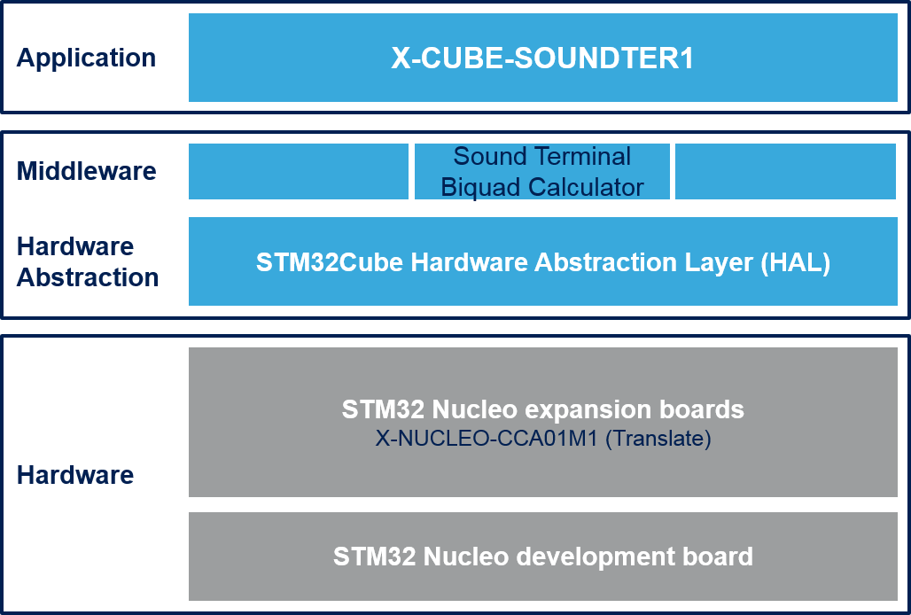

# X-CUBE-SOUNDTER1 Firmware Package

The **X-CUBE-SOUNDTER1** software package is an expansion for **STM32Cube**. This software provides drivers and middleware running on STM32 for interfacing with the **STA350BW** Sound Terminal component mounted on **X-NUCLEO-CCA01M1** expansion board.
It is built on top of STM32Cube software technology that ease portability across different STM32 microcontrollers.

X-CUBE-SOUNDTER1 software features:

-  Complete BSP and drivers to build applications using STA350BW Sound Terminal device.
-  Sound Terminal® Biquad Calculator middleware to ease the computation of STA350BW embedded filters coefficients.
-  Easy portability across different MCU families thanks to STM32Cube.
-  Sample applications that the developer can use to start experimenting with the code.
-  Free user-friendly license terms.

Examples implementation available for X-NUCLEO-CCA01M1 STM32 expansion board plugged on top of 

-  NUCLEO-F401RE
-  NUCLEO-F072RB
-  NUCLEO-L476RG
-  NUCLEO-F746ZG
-  NUCLEO-L053R8

The figure below shows the overall architecture.

-  At the bottom layer there are the HW components: the STM32 MCU and the STA350BW Sound Terminal® device.
-  The drivers abstract low level details of the hardware and allow the middleware layer to provide functionalities in a hardware independent fashion. 
-  The application provide examples of how to use the code.

Here is the list of references to user documents:

- [UM1976](https://www.st.com/resource/en/user_manual/dm00245223.pdf) : Getting started with the X-CUBE-SOUNDTER1 software package for STA350BW Sound Terminal® device expansion for STM32Cube
- [STA350BW](https://www.st.com/content/st_com/en/products/audio-ics/sound-terminal-digital-audio-subsystems/sta350bw.html) : Sound Terminal 2.1-channel high-efficiency digital audio system
- [STM32Cube](https://www.st.com/stm32cube) : STM32Cube
- [STM32 Nucleo boards](https://www.st.com/stm32nucleo) : STM32 Nucleo boards
- [STM32 Nucleo expansion boards](https://www.st.com/x-nucleo) : STM32 Nucleo expansion boards

## Known limitations

Requirements not met

  Headline
  ----------------------------------------------------------
  STM32L053R8 supports up to one X-NUCLEO-CCA01M1 expansion board

## Development toolchains and compilers

-   IAR Embedded Workbench for ARM (EWARM) toolchain V9.20.1 + ST-LINK/V2
-   RealView Microcontroller Development Kit (MDK-ARM) toolchain V5.37.0 + ST-LINK/V2
-   STM32CubeIDE Version 1.10.1 + ST-LINK/V2

## Supported devices and boards

- STM32F401RE, STM32L053R8, STM32F072, STM32L476 and STM32F746 devices
- [NUCLEO-F072RB](https://www.st.com/content/st_com/en/products/evaluation-tools/product-evaluation-tools/mcu-mpu-eval-tools/stm32-mcu-mpu-eval-tools/stm32-nucleo-boards/nucleo-f072rb.html) Rev C
- [NUCLEO-F401RE](https://www.st.com/content/st_com/en/products/evaluation-tools/product-evaluation-tools/mcu-mpu-eval-tools/stm32-mcu-mpu-eval-tools/stm32-nucleo-boards/nucleo-f401re.html) Rev C
- [NUCLEO-F746ZG](https://www.st.com/content/st_com/en/products/evaluation-tools/product-evaluation-tools/mcu-mpu-eval-tools/stm32-mcu-mpu-eval-tools/stm32-nucleo-boards/nucleo-f746zg.html) Rev B
- [NUCLEO-L053R8](https://www.st.com/content/st_com/en/products/evaluation-tools/product-evaluation-tools/mcu-mpu-eval-tools/stm32-mcu-mpu-eval-tools/stm32-nucleo-boards/nucleo-l053r8.html) Rev C
- [NUCLEO-L476RG](https://www.st.com/content/st_com/en/products/evaluation-tools/product-evaluation-tools/mcu-mpu-eval-tools/stm32-mcu-mpu-eval-tools/stm32-nucleo-boards/nucleo-l476rg.html) Rev C
- [X-NUCLEO-CCA01M1](https://www.st.com/content/st_com/en/products/ecosystems/stm32-open-development-environment/stm32-nucleo-expansion-boards/stm32-ode-translate-hw/x-nucleo-cca01m1.html)

## Backward Compatibility

- None

## Dependencies

- None
